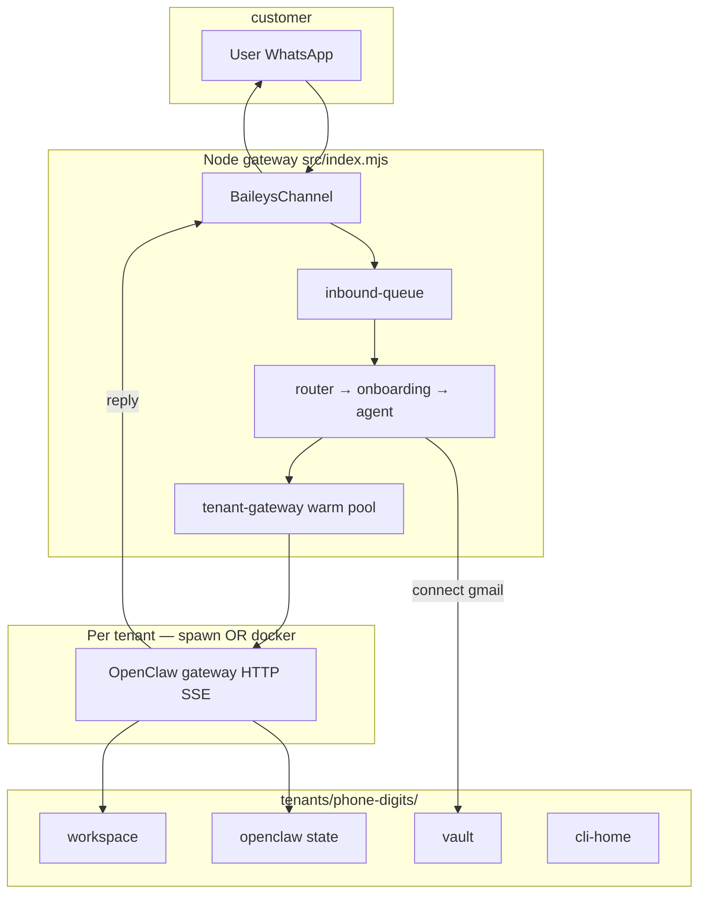

# Rocky AI

WhatsApp chief-of-staff: **one shared WhatsApp number**, **one isolated OpenClaw brain per customer**. Each tenant brings their own LLM (Claude subscription or Codex/API key) and connects private tools (Gmail/Calendar) via OAuth.

Customers only **message** the shared number. They never scan a QR. QR pairing is an **internal ops step** to link our Baileys session.

---

## Clone and run (first time)

Anyone on the team can clone this repo and run an isolated Rocky on their own machine. Your WhatsApp session, phones, tokens, and tenant data stay **local** (gitignored).

### Prerequisites

- Node.js ≥ 22.14
- Docker Desktop / Engine (for the recommended docker runtime)
- Optional: [ngrok](https://ngrok.com/) if you will test Google/Claude OAuth from a phone browser
- Optional: `npm install -g openclaw` only if you use `ROCKY_OPENCLAW_RUNTIME=spawn`

### 1. Install

```bash
git clone <this-repo-url>
cd <repo>
npm install
npm run docker:build:openclaw   # once — builds rocky-openclaw:2026.7.1-2
```

Windows (PowerShell) copy:

```powershell
copy .env.example .env.local
copy rocky.config.example.json rocky.config.json
```

macOS / Linux:

```bash
cp .env.example .env.local
cp rocky.config.example.json rocky.config.json
```

### 2. Edit local-only files (never commit these)

| File | What to set |
| --- | --- |
| `.env.local` | `ROCKY_API_TOKEN` (long random), optional `ROCKY_PUBLIC_BASE_URL`, Google OAuth if testing Gmail |
| `rocky.config.json` | **Your** phone digits in `operatorPhones` and `allowFrom` |

Recommended **dev** profile in `.env.local`:

```env
ROCKY_PROFILE=dev
ROCKY_INSTANCE_ID=local
ROCKY_OPENCLAW_RUNTIME=docker
ROCKY_CLI_HOST_FALLBACK=0
ROCKY_API_TOKEN=<long random secret>
ROCKY_PUBLIC_BASE_URL=https://YOUR-TUNNEL.example
```

**Do not commit:** `.env.local`, `rocky.config.json`, `baileys_auth/`, `tenants/`, `ops/`, or any `creds.json` / OAuth vault files. Templates are `.env.example` and `rocky.config.example.json` only.

### 3. Start

```bash
npm start          # preferred — kills any old Rocky process first
npm test           # 111 tests; run before pushing
```

- HTTP: `http://127.0.0.1:8787`
- Health: `http://127.0.0.1:8787/health`
- Signup UI: `http://127.0.0.1:8787/signup/`

**Do not use `npm run dev` (`--watch`) when a real WhatsApp number is paired** — file-watch restarts can unlink the Baileys session.

### 4. Pair the shared WhatsApp number (ops)

1. `npm start` — QR prints in the terminal and saves to `baileys_auth/qr.png`
2. On the **manager** phone: WhatsApp → **Linked devices → Link a device** → scan
3. Wait for: `[baileys] connected as …`
4. Test with **Message yourself** (self-chat)

`baileys_auth/` is reused on restart. Only wipe it for a deliberate re-pair. Never run two Rocky processes against the same auth dir.

### 5. Text it as a customer (isolation check)

1. From **another** phone (listed in `allowFrom`, or open allowlist in solo soak), message the shared number.
2. Complete onboarding (name + `claude` / `codex`).
3. Say `connect claude` (or `connect codex` / `connect gmail`) and finish the link flow.
4. Send a real task — OpenClaw runs in **that sender’s** `tenants/<phone-digits>/` only (workspace, vault, cli-home, docker container `rocky-oc-local-<phone>`).

Two phones → two tenant folders → two OpenClaw brains. They do not share tokens or memory.

### Connect LLM + tools (from WhatsApp)

| User says | What happens |
| --- | --- |
| `connect claude` | Subscription OAuth link → paste `CODE#STATE` at `/connect/claude/` → `vault/llm-auth.json` + `cli-home/claude/` |
| `connect codex` | Paste OpenAI API key at `/connect/llm/` → `vault/llm-auth.json` |
| `connect gmail` | Google OAuth → `vault/google-oauth.json` → MCP merged into tenant OpenClaw config |

For OAuth from a phone browser, run `ngrok http 8787` and set `ROCKY_PUBLIC_BASE_URL` to that HTTPS URL. Register redirect: `{ROCKY_PUBLIC_BASE_URL}/oauth/google/callback`.

### Mock mode (no WhatsApp)

```bash
# Unix
ROCKY_CHANNEL=mock npm start
npm run mock -- +15551234567 "hello"
```

```powershell
# Windows
$env:ROCKY_CHANNEL="mock"
npm start
npm run mock -- +15551234567 "hello"
```

Mock inject: `POST /api/dev/message` with `Authorization: Bearer <ROCKY_API_TOKEN>`. **Returns 404 in Baileys mode.**

---

## Product idea

| What users experience | What we run |
| --- | --- |
| Text one WhatsApp number like a private assistant | Single Baileys linked-device session |
| “Connect Gmail” → link in chat | Per-tenant OAuth vault + Gmail/Calendar MCP |
| Feels like *their* Rocky | Router maps sender → `tenants/<id>/` → that tenant’s OpenClaw only |

**Hard rules (persona + code):**

- Never tell customers about shared numbers, other tenants, gateways, or multi-tenancy.
- Tokens, workspace, OpenClaw state, and CLI login live only under `tenants/<id>/`.
- The only shared piece is **WhatsApp transport** (one Baileys session).

**Non-goals:** Kapso, Meta Cloud API, consumer WhatsApp Groups API. See [`docs/PLAN.md`](docs/PLAN.md).

---

## Architecture



### One inbound message (ACTIVE tenant)

1. **`baileys-channel.mjs`** — receives DM; handles phone JID + LID; **Message yourself** uses learned self-LID (`baileys_auth/self-lids.json`).
2. **`inbound-queue.mjs`** — coalesce ~1.5s bursts; one turn at a time per phone; busy ack if already running.
3. **`onboarding.mjs`** — tenant lookup; allowlist gate (`ROCKY_ALLOW_FROM`); operator phones skip onboarding.
4. **`agent.mjs`** — connect intents → OAuth; else OpenClaw turn via **`tenant-openclaw.mjs`**.
5. **`tenant-gateway.mjs`** — keeps a warm OpenClaw gateway per tenant (host **spawn** or **docker** container); HTTP SSE turn; idle stop after 2h.

### Onboarding states

| State | Behavior |
| --- | --- |
| `NEW` | Welcome; ask name or plan |
| `COLLECT_PLAN` | Name + `claude` or `codex` |
| `PROVISION` | Copy `templates/workspace/`; create dirs |
| `ACTIVE` | Messages → OpenClaw |

Web signup: `POST /api/signup` (Bearer auth) or UI at `/signup/`. Names are sanitized before `IDENTITY.md` (`sanitizeDisplayName`).

---

## Dev vs prod profiles

Two env vars control deployment behavior without forking code:

| Variable | Dev (default) | Prod |
| --- | --- | --- |
| `ROCKY_PROFILE` | `dev` (or unset) | `prod` |
| `ROCKY_INSTANCE_ID` | `local` (default) | Unique per server, e.g. `sg1` |
| `ROCKY_OPENCLAW_RUNTIME` | `spawn` or `docker` | **Must be `docker`** (enforced at startup) |
| `ROCKY_ALLOW_FROM` | Optional (empty = open) | **Required** non-empty allowlist |
| `ROCKY_CLI_HOST_FALLBACK` | `0` recommended; `1` = **operator phones only** | **Forbidden** (startup fails if `1`) |
| `ROCKY_API_TOKEN` | Recommended | **Required** |
| `/health` detail | Full on localhost | `{ok:true}` unless Bearer auth |

**Why `ROCKY_INSTANCE_ID` matters:** Docker containers are named `rocky-oc-<instance>-<tenant>`, e.g. `rocky-oc-local-15550001111` on a laptop vs `rocky-oc-sg1-15550001111` on prod. Local dev never stops or replaces prod containers on a shared Docker host.

**Prod startup gate:** `validateStartupSecurity()` in `src/config.mjs` exits the process if prod is misconfigured (missing docker, allowlist, API token, or host fallback enabled).

### Example `.env.local` (developer laptop)

```env
ROCKY_PROFILE=dev
ROCKY_INSTANCE_ID=local
ROCKY_PORT=8787
ROCKY_CHANNEL=baileys
ROCKY_API_TOKEN=<secret>
ROCKY_PUBLIC_BASE_URL=https://YOUR-TUNNEL.example
ROCKY_OPENCLAW_RUNTIME=docker
ROCKY_OPENCLAW_IMAGE=rocky-openclaw:2026.7.1-2
ROCKY_OPENCLAW_MAX_WARM=3
ROCKY_CLI_HOST_FALLBACK=0
# ROCKY_ALLOW_FROM=15550001111   # optional in dev; required in prod
GOOGLE_CLIENT_ID=
GOOGLE_CLIENT_SECRET=
```

### Example prod host env (before linking a customer number)

```env
ROCKY_PROFILE=prod
ROCKY_INSTANCE_ID=sg1
ROCKY_OPENCLAW_RUNTIME=docker
ROCKY_OPENCLAW_IMAGE=rocky-openclaw:2026.7.1-2
ROCKY_CLI_HOST_FALLBACK=0
ROCKY_ALLOW_FROM=15550001111,15550002222
ROCKY_API_TOKEN=<strong secret>
ROCKY_PUBLIC_BASE_URL=https://rocky.yourdomain.com
GOOGLE_CLIENT_ID=
GOOGLE_CLIENT_SECRET=
```

---

## Isolation and security

### Filesystem tenant model (no DB yet)

```
tenants/
  index.json
  <phone-digits>/
    tenant.json
    workspace/           # IDENTITY, SOUL, USER, … (from templates/workspace/)
    openclaw/            # OPENCLAW_STATE_DIR, openclaw.json, sessions
    cli-home/
      claude/            # CLAUDE_CONFIG_DIR
      codex/             # CODEX_HOME
    vault/
      google-oauth.json
      llm-auth.json      # Claude OAuth / OpenAI API key
    mcp.servers.json
```

Templates in `templates/workspace/` are **neutral** (no personal contacts or Gmail). New tenants get a generic Rocky persona.

### OpenClaw runtime modes

| Mode | When | Isolation |
| --- | --- | --- |
| **`spawn`** (default in dev) | No Docker | Host process; per-tenant env paths; same OS user |
| **`docker`** (required in prod) | `ROCKY_OPENCLAW_RUNTIME=docker` | One container per tenant; only `/tenant` bind-mounted; memory/CPU capped |

Build image once: `npm run docker:build:openclaw` → `rocky-openclaw:2026.7.1-2`.

Container entrypoint (`docker/openclaw/entrypoint.sh`): loads vault into env, rewrites workspace paths, keeps mutable OpenClaw state in-container (Windows bind-mount `chmod` workaround).

### Security checklist (implemented)

| Control | Status |
| --- | --- |
| `POST /api/dev/message` | 404 in Baileys mode; Bearer in mock |
| `/api/tenants`, `/api/signup` | Bearer `ROCKY_API_TOKEN` required |
| `/health` | Minimal in prod without auth |
| Signup phone | Gated by allowlist when prod or `ROCKY_ALLOW_FROM` set |
| Operator match | **Exact** phone digits only (no suffix tricks) |
| Host CLI fallback | Dev + operator only; never in prod |
| Google client secret | Env only — not written to tenant files |
| OAuth tokens | `vault/` only — stripped from MCP headers in openclaw.json |
| Baileys `connectionReplaced` | No auto-reconnect — manual restart |
| Single gateway instance | `scripts/start.mjs` kills prior process + frees port |

### Known gaps (not code blockers for dev)

- **Google OAuth scopes** include `gmail.readonly`, `gmail.compose`, `gmail.send`, Calendar — restricted scopes need Google verification + CASA before ~100 users; Testing mode refresh tokens expire in 7 days.
- **`npm run dev`** still exists — do not use with paired WhatsApp.
- **BYO Claude subscription** — narrow allowed lane under Anthropic ToS; not a free multi-tenant host login.

---

## Repository layout

```
src/
  index.mjs                 HTTP: health, signup, OAuth callbacks, connect APIs
  api-auth.mjs              Bearer token gate for admin routes
  baileys-channel.mjs         Shared WhatsApp (Baileys); self-LID; pairing lock
  channel.mjs               MockChannel
  router.mjs / inbound-queue.mjs / onboarding.mjs / agent.mjs
  provision.mjs             Tenant dirs + sanitizeDisplayName
  connect.mjs               WhatsApp connect intents
  oauth/google.mjs          Google OAuth → vault
  oauth/claude.mjs          Claude subscription OAuth (PKCE)
  llm-auth.mjs              Vault for Claude/Codex credentials
  cli-home.mjs              Per-tenant Claude/Codex paths
  openclaw/
    tenant-openclaw.mjs     Config + HTTP SSE turns
    tenant-gateway.mjs      Warm pool (spawn or docker)
    docker-gateway.mjs      Container lifecycle
    openclaw-singleton.mjs  Kill foreign host gateways
  mcp/tenant-mcp.mjs        Gmail/Calendar MCP into openclaw.json
  config.mjs                Env, profiles, allowlist, security validation

scripts/start.mjs           Single-instance starter (use npm start)
docker/openclaw/entrypoint.sh
Dockerfile.openclaw
templates/workspace/        Neutral persona seed
public/signup/              Web signup
public/connect/claude/      Claude OAuth paste page
public/connect/llm/         Codex API key paste page
test/                       npm test (111 tests)
baileys_auth/               Session + qr.png (gitignored)
tenants/                    All runtime user data (gitignored)
```

---

## Installation

### Requirements

| Requirement | Notes |
| --- | --- |
| Node.js ≥ 22.14 | ESM, no build step |
| Docker Desktop / Engine | Required for `ROCKY_OPENCLAW_RUNTIME=docker` |
| OpenClaw CLI | `npm install -g openclaw` |
| Claude Code / Codex CLI | Per plan you test; tenant login goes in `cli-home/` or OAuth |
| ngrok | Local Google/Claude OAuth from phone |

### Repo dependencies

```powershell
npm install
```

| Package | Purpose |
| --- | --- |
| `@whiskeysockets/baileys` | WhatsApp linked device |
| `qrcode` | Ops QR (`baileys_auth/qr.png`) |
| `pino`, `@hapi/boom`, `libsignal` | Baileys support |

---

## Local development workflows

### A. Full stack with WhatsApp + Docker (recommended)

Matches prod topology on your laptop.

```powershell
npm run docker:build:openclaw
# .env.local: ROCKY_PROFILE=dev, ROCKY_INSTANCE_ID=local, ROCKY_OPENCLAW_RUNTIME=docker
npm start
# Pair WhatsApp if needed; Message yourself to test
```

### B. Fast soak without Docker

```powershell
# .env.local: ROCKY_OPENCLAW_RUNTIME=spawn (or omit — spawn is default)
npm start
```

Use only for quick gateway/onboarding tests. Prod must use docker profile.

### C. Operator dev with host Claude (optional)

```env
ROCKY_CLI_HOST_FALLBACK=1
```

Only **operator phones** (`rocky.config.json` → `operatorPhones`) can fall back to host `~/.claude` / `~/.codex`. Customer tenants still need per-tenant OAuth/cli-home. **Never enable on prod or paired public numbers.**

### D. Admin HTTP

All admin routes need `Authorization: Bearer <ROCKY_API_TOKEN>`:

```powershell
curl -H "Authorization: Bearer $env:ROCKY_API_TOKEN" http://127.0.0.1:8787/api/tenants
```

---

## WhatsApp ops notes

| Topic | Guidance |
| --- | --- |
| Start command | Always `npm start` (not raw `node src/index.mjs`) |
| Re-pair | Backup `baileys_auth/` → delete → scan new QR; rare break-glass |
| Bad MAC / decrypt failures | Do **not** wipe auth; wait for WhatsApp retry |
| `connectionReplaced` | Stop other clients / `--watch`; restart manually |
| Self-chat | Use **Message yourself**; bot learns LID in `self-lids.json` |
| Logout alerts | `ops/alerts.jsonl`; optional `ROCKY_LOGOUT_WEBHOOK_URL` |

---

## Google + MCP (Gmail / Calendar)

User: **`connect gmail`** → OAuth link → callback → `vault/google-oauth.json` → MCP in `openclaw.json`.

Natural language inbox/calendar after connect goes through **OpenClaw + MCP**, not REST helpers in `google/tools.mjs` (legacy bridge).

Enable in Google Cloud: Gmail API, Calendar API, Gmail MCP API, Calendar MCP API.

---

## Environment variables (reference)

| Variable | Description |
| --- | --- |
| `ROCKY_PROFILE` | `dev` (default) or `prod` — see [Dev vs prod](#dev-vs-prod-profiles) |
| `ROCKY_INSTANCE_ID` | Docker namespace (`local` dev; unique on prod) |
| `PORT` / `ROCKY_PORT` | HTTP port (default 8787) |
| `ROCKY_CHANNEL` | `baileys` (default) or `mock` |
| `ROCKY_API_TOKEN` | Bearer for `/api/tenants`, `/api/signup`, mock `/api/dev/message` |
| `ROCKY_PUBLIC_BASE_URL` | Public HTTPS for OAuth links (ngrok locally) |
| `ROCKY_SHARED_NUMBER` | Display in logs only |
| `ROCKY_ALLOW_FROM` | WhatsApp allowlist; empty = open (unsafe on public URL) |
| `ROCKY_OPERATOR_PHONES` | Comma-separated; also set in `rocky.config.json` |
| `ROCKY_CLI_HOST_FALLBACK` | `1` = host CLI for **operators only** in dev |
| `ROCKY_OPENCLAW_RUNTIME` | `spawn` or `docker` |
| `ROCKY_OPENCLAW_IMAGE` | Default `rocky-openclaw:2026.7.1-2` |
| `ROCKY_OPENCLAW_WARM` | `1` (default) warm gateway pool |
| `ROCKY_OPENCLAW_MAX_WARM` | Cap concurrent gateways; `3` laptop, `0` = unlimited prod |
| `ROCKY_OPENCLAW_GATEWAY_IDLE_MS` | Idle stop (default 2h) |
| `ROCKY_OPENCLAW_KILL_FOREIGN` | Kill unmanaged host OpenClaw (default on) |
| `GOOGLE_CLIENT_ID` / `GOOGLE_CLIENT_SECRET` | Rocky-owned OAuth client |
| `ROCKY_INBOUND_COALESCE_MS` | Burst merge (default 1500) |
| `ROCKY_LOGOUT_WEBHOOK_URL` | Optional logout webhook |

Non-secret defaults: `rocky.config.json` from [`rocky.config.example.json`](rocky.config.example.json).

Loader: `load-env.mjs` reads `.env.local`; existing `process.env` wins.

---

## Testing

```powershell
npm test
```

**111 tests** — provisioning, onboarding, OAuth (Google + Claude), MCP, inbound queue, Baileys helpers, docker isolation, security profile, Google REST tools, tenant index, ops alerts, agent connect flows, and config validation.

Manual soak (not automated): live Baileys session, real OpenClaw + Claude turn, live Gmail MCP.

Key tests:

| Test file | What it verifies |
| --- | --- |
| `test/isolation-two-tenants.test.mjs` | Disjoint tenant paths/env |
| `test/docker-isolation-smoke.test.mjs` | Docker bind paths + container names |
| `test/security-profile.test.mjs` | Profile, operator match, fallback scope |
| `test/baileys-self-chat.test.mjs` | LID self-chat detection |
| `test/api-auth.test.mjs` | Bearer gate |

---

## Deployment

1. **Long-lived VM** with persistent disk for `tenants/` and `baileys_auth/`.
2. Set **`ROCKY_PROFILE=prod`** + env from [prod example](#example-prod-host-env-before-linking-a-customer-number).
3. `npm run docker:build:openclaw` on the host.
4. Real HTTPS domain for `ROCKY_PUBLIC_BASE_URL` (not ngrok).
5. Process manager for `npm start` (not `--watch`).
6. Baileys re-pair only when WhatsApp revokes device (`loggedOut`).

**Do not** deploy to serverless — Baileys needs a persistent WebSocket.

---

## Current status

**Working:**

- Baileys gateway + single-instance start + self-LID self-chat
- Per-tenant warm OpenClaw (spawn or docker) + HTTP SSE turns
- Claude subscription OAuth + Codex API key connect flows
- Google OAuth + per-tenant MCP config
- Security profiles (dev/prod), instance-scoped Docker, admin API auth
- Onboarding (WhatsApp + web signup) + neutral workspace templates
- 111 automated tests

**Before linking a production customer number:**

- [ ] `ROCKY_PROFILE=prod`, `ROCKY_INSTANCE_ID=<unique>`
- [ ] `ROCKY_OPENCLAW_RUNTIME=docker`, `ROCKY_CLI_HOST_FALLBACK=0`
- [ ] `ROCKY_ALLOW_FROM` set to known phones
- [ ] `ROCKY_API_TOKEN` set; real HTTPS `ROCKY_PUBLIC_BASE_URL`
- [ ] Google OAuth verification plan for scale

**Later:**

- DB for billing / multi-server routing (filesystem is fine for MVP)
- End-to-end soak: WhatsApp → OpenClaw → live Gmail MCP on prod VM

---

## Quick reference

| Question | Answer |
| --- | --- |
| How do I start locally? | Copy `.env.example` → `.env.local`, copy `rocky.config.example.json` → `rocky.config.json`, edit phones/token, `npm start` |
| What must stay off GitHub? | `.env.local`, `rocky.config.json`, `baileys_auth/`, `tenants/`, `ops/`, vaults, `creds.json` |
| Dev vs prod? | `ROCKY_PROFILE` + `ROCKY_INSTANCE_ID` — [section above](#dev-vs-prod-profiles) |
| Where is routing? | `router.mjs` → `onboarding.mjs` → `agent.mjs` |
| Where is OpenClaw? | `openclaw/tenant-openclaw.mjs` + `tenant-gateway.mjs` |
| Where is tenant data? | `tenants/<phone-digits>/` |
| Where are secrets? | `.env.local`; per-tenant `vault/`; `cli-home/` |
| Connect Claude? | WhatsApp `connect claude` → `/connect/claude/` |
| Connect Codex? | WhatsApp `connect codex` → `/connect/llm/` |
| Run tests? | `npm test` |
| Build plan? | [`docs/PLAN.md`](docs/PLAN.md) |

Research notes: [`docs/whatsapp-groups-agent-review.md`](docs/whatsapp-groups-agent-review.md).
